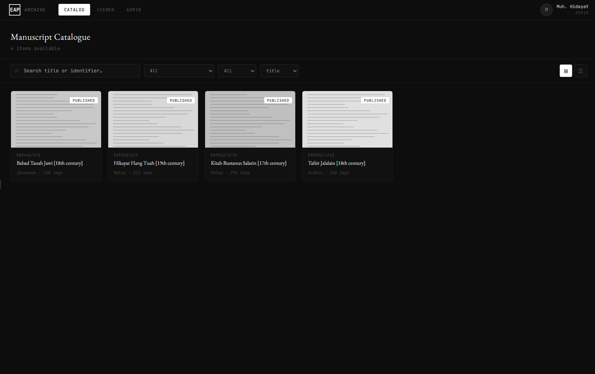
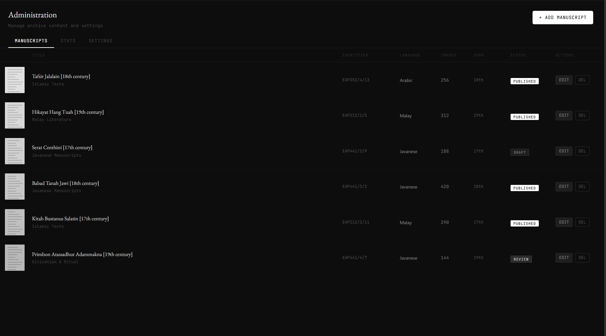
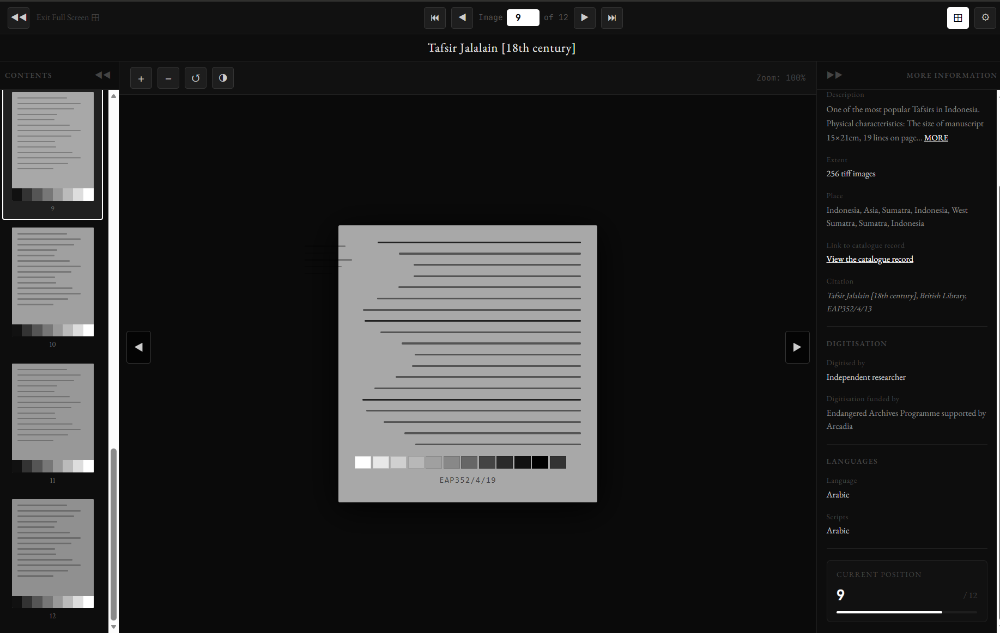

# Product Requirements Document (PRD): Archival Digital Library

**Project Name:** Gibran Archival Library (GAL)  
**Version:** 1.0  
**Status:** In-Review

---

## 1. Executive Summary
This system is designed to display digital collections through a three-pane viewer interface. The primary objective is to prioritize the visualization of high-resolution documents while ensuring seamless access to comprehensive metadata information within a single integrated screen.

## 2. User Roles
*   **Guest:** Access to the public catalog for browsing purposes.
*   **Member:** Authorized to view full collections, manage personal bookmarks, and access reading history.
*   **Administrator:** Responsible for content curation, detailed metadata entry, and comprehensive file management.

## 3. Functional Requirements

### 3.1. Viewer Interface
**Layout:** A fixed layout architecture comprising three responsive columns.

#### Navigational Sidebar (Left)
*   Interactive table of contents.
*   Clickable page thumbnails for rapid navigation.

#### Main Canvas (Center)
*   Tiled image-based viewer to ensure efficient loading of high-resolution files.
*   **Control Interface:** Zoom In/Out, Fullscreen mode, Rotation, Fit to Screen, and Filter functionality.

#### Information Sidebar (Right)
*   Item title, detailed description, and unique identifier.
*   **Metadata Fields:** Author, Place of Origin, Date or Century, Language, and Licensing details.
*   **Utility Options:** Share functionality and conditional Download access.

### 3.2. Asset Management (Administrator)
*   **Upload Manager:** A system designed for the simultaneous uploading of multiple image assets for a single manuscript or volume.
*   **Metadata Editor:** A comprehensive input form adhering to professional archival standards, such as IIIF compatibility.
*   **Image Processing:** Automated conversion and optimization of image files into web-ready formats, specifically WebP or TIFF, to maintain performance.

### 3.3. Search and Navigation
*   Keyword-based search functionality across all metadata fields.
*   Filtering mechanisms based on archival categories, such as 18th Century Manuscripts, Journals, or Photographic Archives.

## 4. Technical Specifications
*   **Frontend:** React.js utilized in conjunction with Tailwind CSS.
*   **Viewer Engine:** OpenSeadragon integration for high-performance manipulation of high-resolution imagery without latency.
*   **Backend:** Node.js environment employing the Sharp module for advanced image processing.
*   **Database:** PostgreSQL for the management of complex relational metadata.
*   **Security:** Implementation of hotlinking protection and API access restrictions to prevent unauthorized content scraping.

## 5. UI/UX Design Direction
*   **Theme:** Professional Dark Theme utilizing a background palette of `#000` or `#111`.
*   **Typography:** Clean Sans-serif fonts (Inter or Roboto) for the user interface, with Serif fonts reserved for content display in instances of OCR implementation.
*   **Interaction:** Smooth transitions between pages triggered by thumbnail navigation to ensure a premium user experience.

---

## Appendix

*Figure 1: The Manuscript Catalogue interface showing available digital collections with grid/list view options and search/filter functionality.*

*Figure 2: The Administrative Dashboard for managing manuscript metadata, status, and processing.*

*Figure 3: The primary three-pane Viewer Interface featuring navigation (left), high-resolution canvas (center), and detailed metadata (right).*

*This document serves as the formal technical reference for the development of the Gibran Archival Library.*
